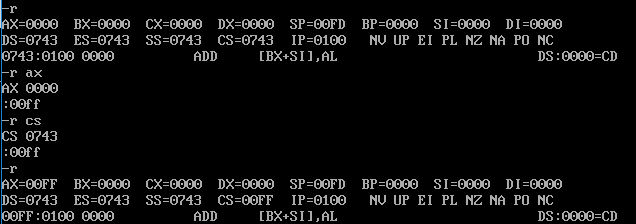
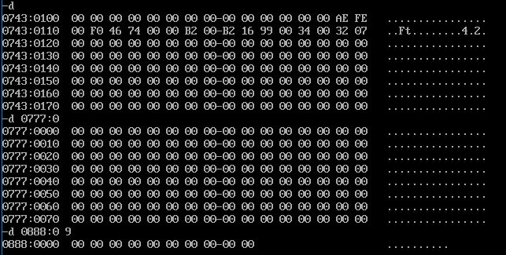
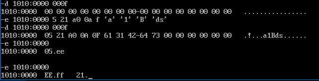
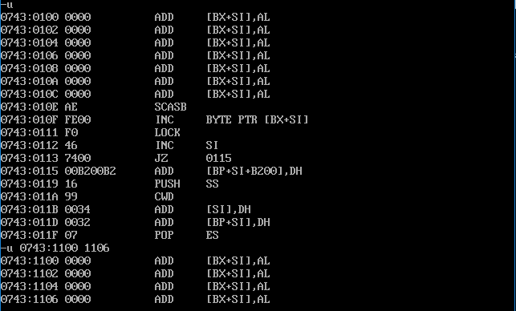
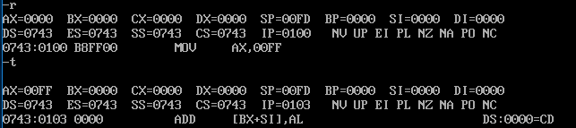
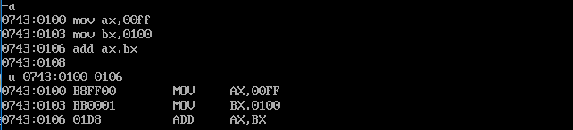

+++
title = "DEBUG常用功能"
date = 2018-02-12

[taxonomies]
categories = ["编程"]
tags = ["DEBUG", "汇编"]
[extra]
toc = true
+++

window 10中DEBUG的安装,以及DEBUG调试中一些常用的命令

### 1.安装

window 10中好像已经没有了Debug的调试工具，需要下载另外的软件

下载安装DOSBox.百度云下载地址：(DOSBOX)\[<https://pan.baidu.com/s/1cC3cuy>\]\
下载后先安装DOSBox0.74-win32-installer.exe\
然后找到文件dos-box0.74.conf(C:\\Users\\username\\AppData\\Local\\DOSBox)\
添加两行

    MOUNT C E:\DEBUG                  # 将目录E:\DEBUG挂载为DOSBOX下的C:  
    set PATH=$PATH$;E:\DEBUG          # 将E:\DEBUG写入环境变量PATH中

并将下载的MASM.exe,LINK.exe,debug.exe三个文件放入目录E:\\DEBUG\
打开软件，输入`c:`就可以使用debug命令了

### 2.常用命令:

R命令：查看改变CPU寄存器的内容\
D命令：查看内存中的内容\
E命令：改写内存中的内容\
U命令：将内存中的机器指令翻译成汇编指令\
T命令：执行一条机器指令\
A命令：以汇编指令的格式在内存中写入一条机器指令\
Q命令：退出DEBUG调试

### 3.命令具体使用实例

#### 3.1R命令

R命令：查看改变CPU寄存器的内容

    -r                          ;显示寄存器的值
    -r reg                      ;改变寄存器reg的值

#### 3.2D命令

D命令：查看内存中的内容\
默认显示128字节的内容

    -d                          ;默认地址
    -d 段地址:偏移地址            ;指定地址
    -d 段地址:偏一偏二            ;两个地址间的内容

#### 3.3E命令

E命令：改写内存中的内容

    -e 起始地址 数据 数据 ...   
    -e 起始地址

#### 3.4U命令

U命令：将内存中的机器指令翻译成汇编指令\
与D命令有些类似\

#### 3.5T命令

T命令：执行内存中的一条机器指令\
指令位置由cs:ip确定\

#### 3.6A命令

A命令：以汇编指令的格式在内存中写入一条机器指令\

