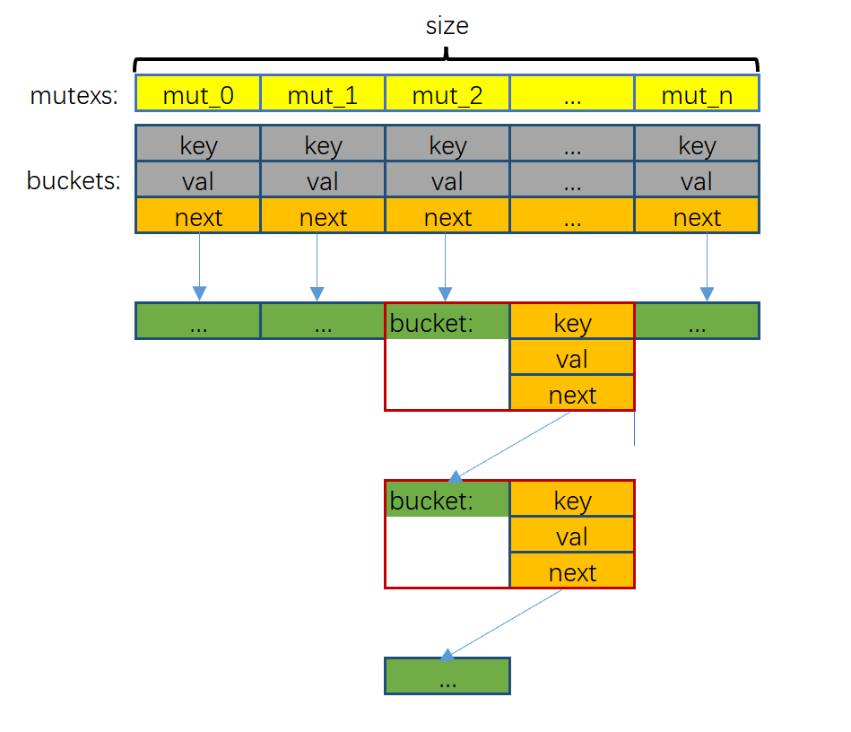
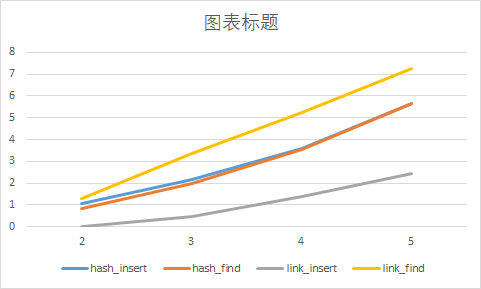

+++
title = "HashMap Data Structure"
date = 2022-08-18

[taxonomies]
categories = ["算法"]
tags = ["HashMap"]

[extra]
toc = true

+++

### HashMap Data Structure

#### implementation

hasmap struct is define:

```c
struct bucket
{
    void* key;
    void* value;
    struct bucket *next; // Using linked list to solve hash conflicts
};

struct hashmap {
    size_t ( *hash )( struct hashmap*, void* ); // hash function
    void ( *key_del )( void* ); // del key
    void ( *val_del )( void* ); // del value
    int ( *cmp )( void*, void* ); //compare key
    size_t size; // hashmap slots
    size_t keysize; // sizeof(type key);

    struct bucket* buckets; // a struct include key and value
    pthread_mutex_t *mutexs; // a mut for every solt
    size_t count; // the number of key in hashmap
    pthread_mutex_t count_mut; // a mut for count

};
```

The specific implementation structure diagram is shown in the figure



the mutexs array is mainly used to lock each hash solts to realize parallel reading and writing. The array buckets is used to record the head pointer of each hash solts, it does not store data.

### Performance Characteristics

#### implementation

This hashmap structure uses a linked list to deal with hash conflicts. Initialize a `sturct buckets` array of size(the number of hashmap solt) to store the head pointer of each solt. When the hash table is empty, its `next` is NULL. Every time a &lt;key,val&gt; is inserted, a new struct bucket will be initialized in the linked list to store it. When remove, delete the corresponding node.

#### test

##### `test_hashmap_base`

This is a base test for testing basic hashmap functions, insert key, delete key, get key,etc.
Test through several different insert and delete operations

##### `test_concurrent`

Test concurrent modifications
Initialize 5 threads for inserting and 5 threads for reading for testing

#### research

Hashmap is a solution to improve efficiency by recompressing data. However, because the hash value generated by the hash function is limited and the data may be more, there are still different data corresponding to the same value after processing by the hash function. There are some ways to resolve hash conflicts:

1.  Open the address method(Linear detection,Ressquare detection etc.)
2.  Chain address method(linked list)
3.  Establish a public overflow area
4.  Re-hashing
    In the hashmap struct, using linked list to resolve hash conflicts.

#### performance
1. My benchmark is a list. I compared the insertion and query efficiency of hashmap and list in the case of one thread, and tested their efficiency (10e2, 10e3, 10e4, 10e5) under different data volumes.
2. I wrote a new file performance.c for testing, which implemented hashmap and list tests and calculated their execution time.



3. The above figure shows the performance comparison between hashmap and ordinary link list. The ordinary link list is relatively fast when inserting, and slower when querying. The speed of hashmap in query is obviously due to the link list. However, due to the need to allocate space when inserting, the speed is slower than the link list.The theories and their time complexity are shown in the following table:

|   | time complexity  |
|:---:|:---:|
|hashmap insert| O(1)  |
|hashmap find|  O(1) |
|link insert| O(1)  |
|link find| O(n)  |

4. Compared with ordinary linear lists, hashmap has a huge advantage in query speed.


### Guaranteeing Safe Access

For the memory security of key and value, the caller ensures its availability.
For any data in the hashmap, only when the remove\_\* method is called, unnecessary space will be deleted through key\_del and val\_del.
And ensure that the space corresponding to the pointer to be returned is not released.
In short, insert transfers the space permissions of key and value to the hashmap structure, and remove\_\* returns the space permissions of key and value to the caller.
