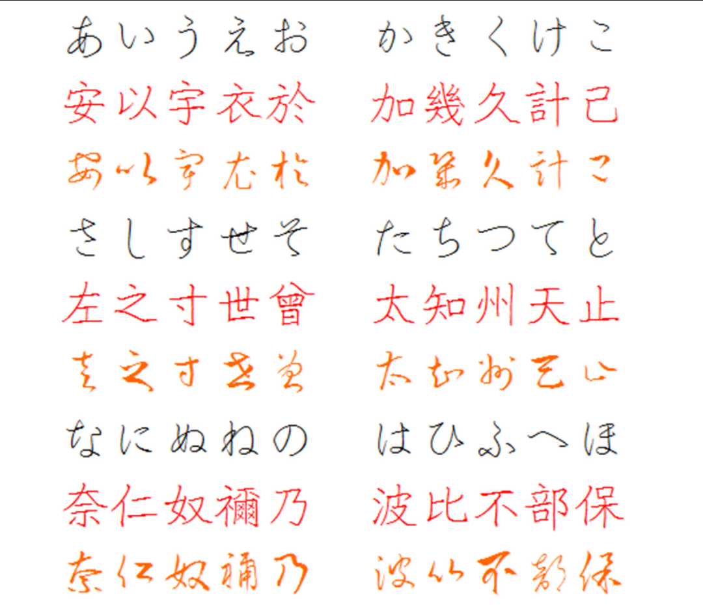
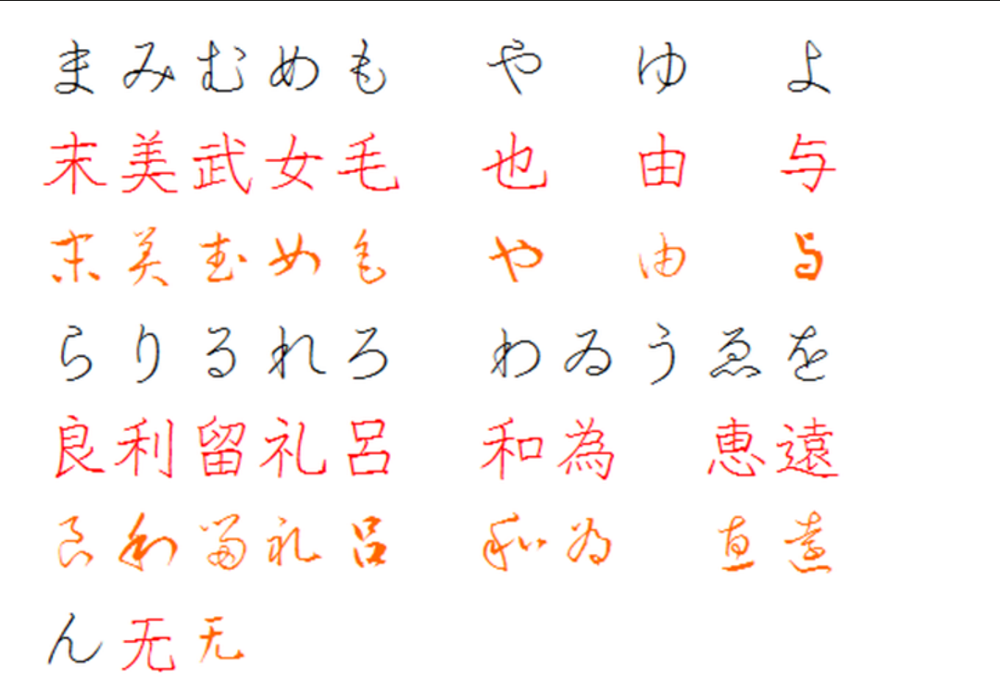
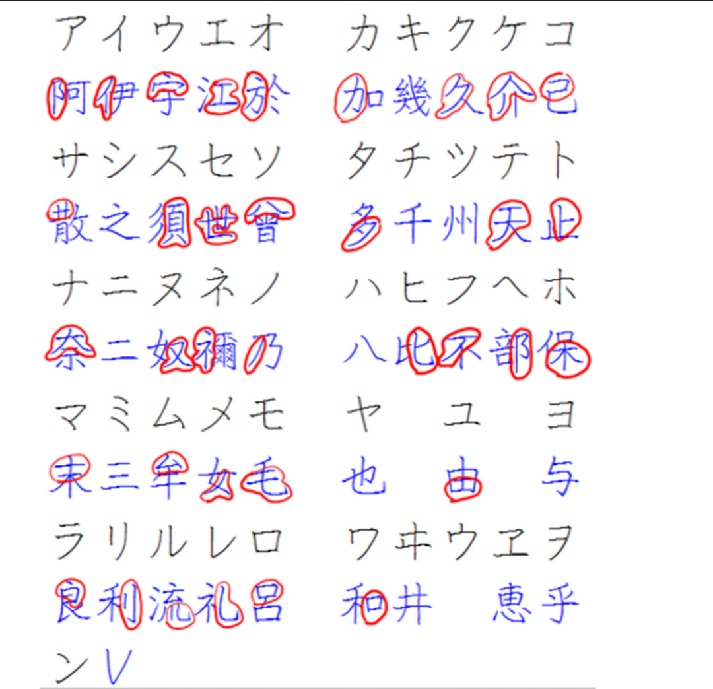

+++
title = "日语五十音-历史"
date = 2023-10-14

[taxonomies]
categories = ["外语"]
tags = []

+++
五十音是日语的基础，主要分为平假名和片假名。每个平假名都有其对应的片假名。平假名是由中国古代文字的草率演变而来；片假名是由中国古代文字的偏旁发展而来。记录一下日文假名和汉字的对照关系。

<!--more-->

## 平假名

## 片假名

