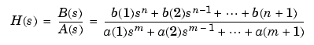
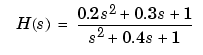
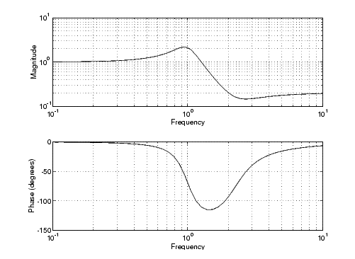
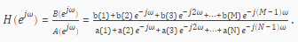
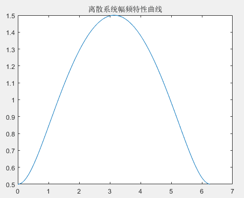
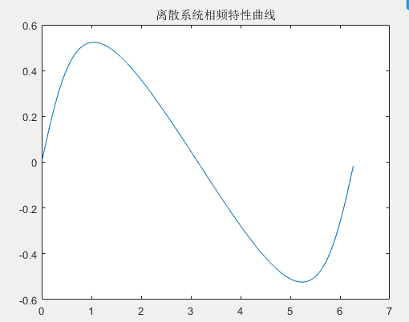

# Matlab函数freqs和freqz


matlab中的freqs和freqz函数

### 1.freqs

模拟滤波器的频率响应\
语法：
```matlab
    h = freqs(b,a,w)
    [h,w] = freqs(b,a)
    [h,w] = freqs(b,a,f)
    freqs(b,a)
```

#### 1.1描述

freqs 返回一个模拟滤波器的H(jw)的复频域响应(拉普拉斯格式)




h = freqs(b, a, w) 根据系数向量计算返回模拟滤波器的复频域响应\
freqs
计算在复平面虚轴上的频率响应h，角频率w确定了输入的实向量，因此必须包含至少一个频率点。\
[h, w] = freqs(b, a) 自动挑选200个频率点来计算频率响应h\
[h, w] = freqs(b, a, f) 挑选f个频率点来计算频率响应h

#### 1.2例子

找到并画出下面传递函数的频率响应


Matlab代码：
```matlab
    a = [1 0.4 1];
    b = [0.2 0.3 1];
    w = logspace(-1, 1);
    freqs(b, a, w);
```

logspace
功能：生成从10的a次方到10的b次方之间按对数等分的n个元素的行向量\
n如果省略，则默认值为50。
```matlab
    h=freqs(b,a,w);
    mag = abs(h);phase = angle(h);
    subplot(2,1,1), loglog(w,mag);
    subplot(2,1,2), semilogx(w,phase);
    f = w/(2*pi);mag = 20*log10(mag);phase = phase*180/pi;
```


### 2.freqz

MATLAB提供了专门用于求离散系统频响特性的函数freqz()\

调用freqz()的格式有以下两种：

#### 2.1[H,w]=freqz(B,A,N)

B和A分别为离散系统的系统函数分子、分母多项式的系数向量，N为正整数，返回量H则包含了离散系统频响
在
0------pi范围内N个频率等分点的值，向量w则包含范围内N个频率等分点。调用中若N默认，默认值为512。

#### 2.2[H,w]=freqz(B,A,N,’whole’)

该调用格式将计算离散系统在0---pi范内的N个频率等分店的频率响应的值。因此，可以先调用freqz()函数计算系统的频率响应，然后利用abs()和angle()函数及plot()函数，即可绘制出系统在
或 范围内的频响曲线。\
例：绘制如下系统的频响曲线\
H(z)=(z-0.5)/z\
MATLAB命令如下：

    B=[1 -0.5];
    A =[1 0];
    [H,w]=freqz(B,A,400,'whole');

H是频率响应的幅度，w是0---pi内的400个点

    Hf=abs(H);
    Hx=angle(H);
    clf
    figure(1)
    plot(w,Hf)
    title('离散系统幅频特性曲线')
    figure(2)
    plot(w,Hx)
    title('离散系统相频特性曲线')




这样画出来的是线性的，要想获得db格式的幅度，需要转换 20\*log10（Hf）\
之后再画就是db格式的\
也可以直接用freqz(b,a,w)这样就会画出幅频响应和相频响应，幅频响应直接是db格式的幅度。
