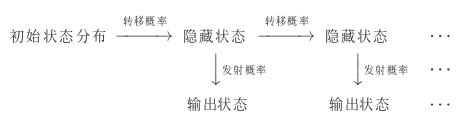

# 基于统计的分词方法


1.n元语言模型(n-gram)
-----------------------------------------------------------------------------------

假设\$S\$表示长度为\$i\$，由\$(w\_1,w\_2,\\dots,w\_m)\$字序列组成的句子，则代表\$S​\$的概率为：

```math
P(S) = P(w_1,w_2,\dots,w_m) = P(w_1)*P(w_2|w_1)*P(w_3|w_2,w_1)\cdots P(w_i|w_1,w_2,\dots,w_{m-1})
```

-   \$n=1\$,uni-gram

```math
P(w_1,w_2,\dots,w_m) =\prod_{i=1}^mP(w_i)
```

-   \$n=2\$,bi-gram

```math
P(w_1,w_2,\dots,w_m) =\prod_{i=1}^mP(w_i|w_{i-1})
```

-   \$n=3\$,tri-gram

```math
P(w_1,w_2,\dots,w_m) =\prod_{i=1}^mP(w_i|w_{i-2}w_{i-1})
```

2.基于HMM的分词
------------------------------------------------------------------

**HMM的参数**

观测序列(输出状态序列),状态序列(隐藏状态序列),初始概率,转移概率(转移概率矩阵),发射概率(发射概率矩阵)


**数学定义**

状态值集合(隐藏状态):\$Q={q\_1,q\_2,\\cdots,q\_N}\$,\$N\$为可能的状态数,对应状态序列\$I​\$

观测值集合(输出状态):\$V={v\_1,v\_2,\\cdots,v\_M}\$,\$M\$为可能的观测数,对应观测序列\$O\$

转移概率矩阵:\$A=\[a*{ij}\];i,j\\in{1,2,\\cdots,N}\$,从\$i\$状态到\$j\$状态的转换概率(\$\\sum*{j=1}\^Na\_{ij}=1\$)

发射概率矩阵(观测概率矩阵):\$B=\[b\_j(k)\];j\\in{1,2,\\cdots,N},k\\in{1,2,\\cdots,M}\$,从状态\$j\$生成观测\$k\$的概率

初始状态分布:\$\\pi\$

模型:\$\\lambda=(A,B,\\lambda)\$,状态序列\$I\$,观测序列\$O\$

**HMM中的三个问题:**

-   概率计算问题:已知模型,求观测序列\$O\$出现的概率;前向后向算法\

-   学习问题:已知观测序列,求模型参数,最大化\$P(O\|\\lambda)\$;鲍姆-韦尔奇(Baum-Welch)算法

    -   已知隐藏序列和观测序列(通过频数估计)

        \$A\_{ij}\$表示隐藏状态\$q\_i\$转移到\$q\_j\$的频率计数

        ```math
        A=[a_{ij}];a_{ij}=\frac{A_{ij}}{\sum_{s=1}^NA_{is}}
        ```

        \$B\_{jk}\$表示隐藏状态\$q\_j\$转移到观测状态\$v\_k\$的频率计数

        ```math
        B=[b_j(k)];b_j(k)=\frac{B_{jk}}{\sum_{s=1}^MB_{js}}
        ```

        \$C(i)\$为所有样本中初始隐藏状态\$q\_j\$的频率计数
        ```math
        \Pi = \pi(i)=\frac{C(i)}{\sum_{s=1}^NC(s)}
        ```

    -   仅知观测序列(鲍姆-韦尔奇算法,EM算法)

        EM算法:最大似然估计用于没有隐变量的概率模型,EM算法可以用于有隐变量的算法模型

        模型参数:
        
        ```math
        \overline{\lambda} = arg\;\max_{\lambda}\sum\limits_{I}P(I|O,\overline{\lambda})logP(O,I|\lambda)
        ```

-   解码问题:已知模型\$\\lambda\$与观测序列\$O\$,求状态序列\$I\$最大化\$P(I\|O)\$;维特比(Viterbi)算法

HMM是一种序列模型,不仅可以用到自然语言处理这个领域,其他领域的应用也很常见:[股指预测](http://tecdat.cn/%e7%94%a8%e6%9c%ba%e5%99%a8%e5%ad%a6%e4%b9%a0%e8%af%86%e5%88%ab%e4%b8%8d%e6%96%ad%e5%8f%98%e5%8c%96%e7%9a%84%e8%82%a1%e5%b8%82%e7%8a%b6%e5%86%b5-%e9%9a%90%e9%a9%ac%e5%b0%94%e7%a7%91%e5%a4%ab/),[语音识别](https://www.jianshu.com/p/16fc3712fdf6),[网络安全](http://www.c-a-m.org.cn/CN/abstract/abstract4637.shtml),[基因序列](https://arxiv.org/abs/1901.06286)等方面

在自然语言处理中,HMM可以应用在分词,词性标注,命名实体识别等各个方面.

在分词方面可以这样理解HMM

观测序列(输出状态序列)----序列构成的句子或短文

状态序列(隐藏状态序列)----标注

初始概率----统计的第一个字序的概率

转移概率(转移概率矩阵)----第\$i\$个字序到第\$i+1\$个自序的标注变换概率

发射概率(发射概率矩阵)----从隐藏状态到输出状态的转换概率

如果把观测序列看作标注,状态序列看作句子,从解码问题转变成学习问题会怎样

在序列预测问题中

HMM模型:当前tag仅依赖前一个tag,当前输出仅依赖当前tag(文档的单词序列是由隐藏状态的标签决定的)

MEMM(最大熵马尔科夫模型)模型:当前tag取决于观察值x(单词)和前一个tag(序列的标签取决于前一个标签和当前的单词)

CRF模型:计算损失时把一句话看作一个整体计算损失

参考资料
---------------------------------------------

1.<https://www.cnblogs.com/hiyoung/archive/2018/09/25/9703976.html>

2.<http://www.52nlp.cn/hmm-learn-best-practices-one-introduction>

3.<https://www.cnblogs.com/en-heng/p/6164145.html?utm_source=debugrun&utm_medium=referral>

4.<http://www.wanguanglu.com/2017/01/03/crf-introduction/>
