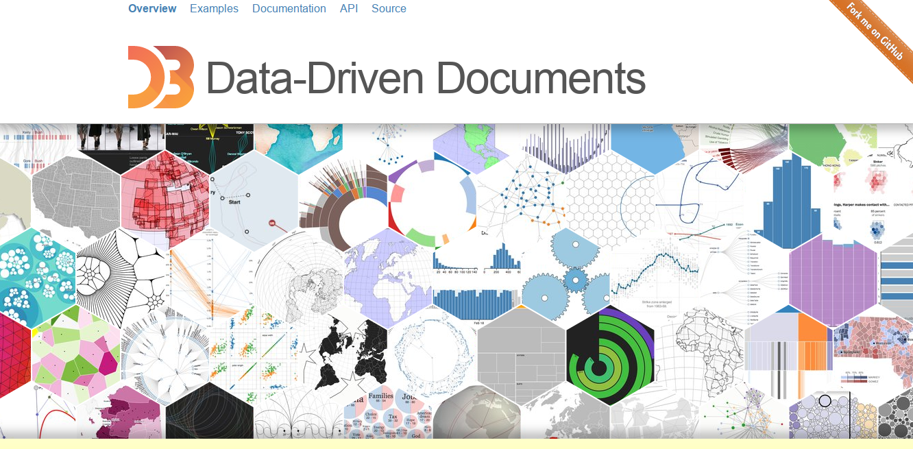
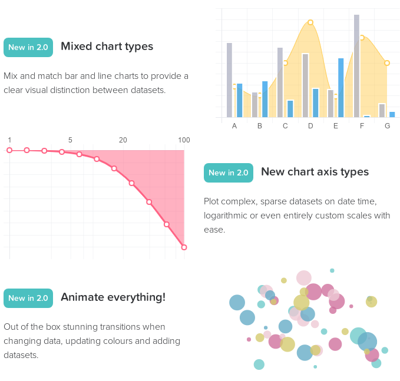
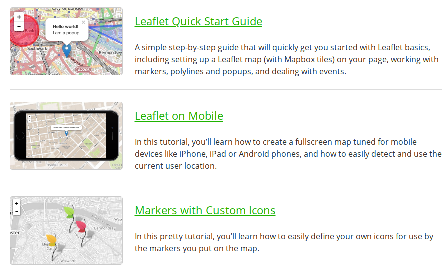

# 数据可视化开源项目

## 1.[D3](https://d3js.org/)

github地址:<https://github.com/d3/d3>

## 2.[chartjs](https://www.chartjs.org)

github地址:<https://github.com/chartjs/Chart.js>

## 3.[leafletjs](https://leafletjs.com/examples.html)

github地址:<https://github.com/Leaflet/Leaflet>

主要是移动端地图的支持

## 4.[echarts](https://echarts.baidu.com/examples/#chart-type-line)

百度家的

github地址:<https://github.com/ecomfe/echarts>

## 5.[Chartist-js](https://gionkunz.github.io/chartist-js/examples.html)

## 6.[sigmajs](http://sigmajs.org/)

## 7.[metricsgraphicsjs](https://metricsgraphicsjs.org/examples.htm)

## 8.[DC.js,开源(D3)](https://dc-js.github.io/dc.js/)

### 9.[阿里数据可视化](https://antv.alipay.com/zh-cn/index.html)

[G2](https://antv.alipay.com/zh-cn/g2/3.x/demo/index.html),[G6](https://antv.alipay.com/zh-cn/g6/2.x/demo/index.html),[F2](https://antv.alipay.com/zh-cn/f2/3.x/demo/index.html),[L7](https://antv.alipay.com/zh-cn/l7/1.x/demo/index.html)
