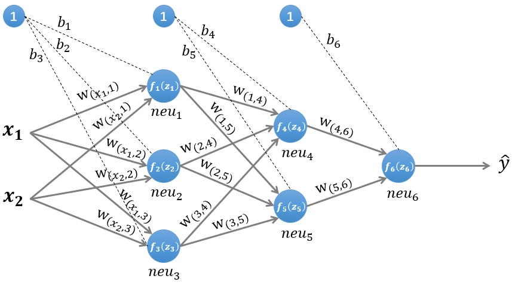

# 神经网络中的前向传播与后向传播



$ f(z) $为激励函数，关于激励函数(又称激活函数)的总结\
隐藏层1输入

```math
z^{(1)}=W^{(1)}x^T+b^{(1)}\tag{1}
```

隐藏层1输出

```math
n^{(1)}=f^{(1)}(z^{(1)})\tag{2}
```

隐藏层2输入

```math
z^{(2)}=W^{(2)}n^{(1)}+b^{(2)}\tag{3}
```

隐藏层2输出

```math
n^{(2)}=f^{(2)}(z^{(2)})\tag{4}
```

隐藏层3输入

```math
z^{(3)}=W^{(3)}n^{(2)}+b^{(3)}\tag{5}
```

隐藏层3输出即输出层

```math
\widehat y = n^{(3)}= f^{(3)}(z{(3)})\tag{6}
```

损失函数

```math
L(y,\widehat y)\tag{7}
```

即隐藏层k+1输入

```math
z^{(k+1)}=W^{(k+1)}n^{(k)}+b^{(k+1)}\tag{8}
```

隐藏层k+1输出

```math
n^{(k+1)}= f^{(k+1)}(z{(k+1)})\tag{9}
```

对损失函数进行总结<https://blog.csdn.net/lien0906/article/details/78429768>\
计算偏导数

```math
\frac {\partial z^{(k)}}{\partial b^{(k)}}=
diag(1,1, \ldots ,1)\tag{10}
```

列向量对列向量求导参见矩阵中的求导

计算偏导数$\frac {\partial L(y,\widehat y)}{\partial z^{(k)}}\$

偏导数$ \frac {\partial L(y,\widehat y)}{\partial z^{(k)}}\ $
又称误差项(error term,也称"灵敏度"),一般用$ \delta $
表示,用$ \delta^{(k)} $
表示第k层神经元的误差项,其值的大小代表了**第k层神经元对最终总误差的影响大小**

```math
\begin{align}
\delta^{(k)} & = \frac {\partial L(y,\widehat y)}{\partial z^{(k)}}\cr
& =\frac {\partial n^{(k)}}{\partial z^{(k)}}*
\frac {\partial z^{(k+1)}}{\partial n^{(k)}}*
\frac {\partial L(y,\widehat y)}{\partial z^{(k+1)}}\cr
& = {f^{(k)}}^{'}(z^{(k)}) * (W^{(k+1)})^T * \delta^{(k+1)}
\end{align}\tag{11}
```

最终需要用的两个导数

```math
\frac {\partial L(y,\widehat y)}{\partial W^{(k)}}
=\frac {\partial L(y,\widehat y)}{\partial z^{(k)}}*
\frac {\partial z^{(k)}}{\partial W^{(k)}}
=\delta^{(k)}*(n^{(k-1)})^T\tag{12}
```

```math
\frac {\partial L(y,\widehat y)}{\partial b^{(k)}}
=\frac {\partial L(y,\widehat y)}{\partial z^{(k)}}*
\frac {\partial z^{(k)}}{\partial b^{(k)}}
=\delta^{(k)}\tag{13}
```

后向传播参数更新

```math
W^{(k)} = W^{(k)} - \alpha(\delta^{(k)}(n^{(k-1)})^T + W^{(k)})\tag{14}
```

```math
b^{(k)} = b^{(k)}-\alpha\delta^{(k)}\tag{15}
```
其中$ \alpha $ 是学习率

后向传播中的正则化,L1正则化,L2正则化
