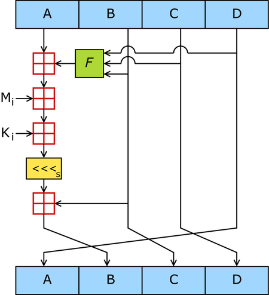
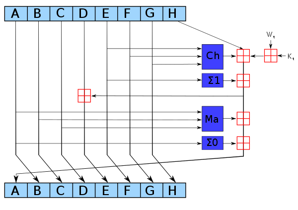

# 常见 Hash 算法

## 什么是 hash 算法

Hash 算法又称散列算法，特点是把任意长度的输出，通过一些列的计算后变成固定长度的输出，这个输出值即为散列值。由于散列值的空间远小于输出空间，因此存在不同输入得到相同输出的情况，这种现象称为碰撞。

## hash 算法的应用

hash 算法应用广泛，主要有七个方面：安全加密、唯一标识、数据校验、散列函数、负载均衡、数据分片、分布式存储。不同的应用利用的 hash 算法不同的特性，具体的算法实现也需要根据情况设计。比较常见的实现有 md5，sha256 等。本文通过这两个算法来研究具体的实现。

## MD5

Md5 算法将输入的不定长数据分为 512bit 的块，并对每个块循环调用 MD5 运算。



一个 MD5 运算由类似的 64 次循环构成，分成 4 组 16 次。F 是一个非线性函数；一个函数运算一次。Mi 表示一个 32-bits 的输入数据，Ki 表示一个 32-bits 常数，用来完成每次不同的计算。

## md5 的 python 实现

```python
def Md5sum(message: bytes) -> bytes:
    # 定义常量，用于初始化128位变量，注意字节顺序，A=0x01234567，这里低值存放低字节，
    # 即01 23 45 67，所以运算时A=0x67452301，其他类似。
    # 用字符串的形势，是为了和hex函数的输出统一，hex(10)输出为'0xA',注意结果为字符串。
    h0 = 0x67452301
    h1 = 0xefcdab89
    h2 = 0x98badcfe
    h3 = 0x10325476

    # 定义每轮中循环左移的位数，用元组表示 4*4*4=64
    R = (7, 12, 17, 22) * 4 + (5, 9, 14, 20) * 4 + \
        (4, 11, 16, 23) * 4 + (6, 10, 15, 21) * 4
    # 定义常数K 64
    # K[i] = (int(abs(math.sin(i + 1)) * 2 ** 32)) & 0xffffffff
    K = (0xd76aa478, 0xe8c7b756, 0x242070db, 0xc1bdceee,
         0xf57c0faf, 0x4787c62a, 0xa8304613, 0xfd469501, 0x698098d8,
         0x8b44f7af, 0xffff5bb1, 0x895cd7be, 0x6b901122, 0xfd987193,
         0xa679438e, 0x49b40821, 0xf61e2562, 0xc040b340, 0x265e5a51,
         0xe9b6c7aa, 0xd62f105d, 0x02441453, 0xd8a1e681, 0xe7d3fbc8,
         0x21e1cde6, 0xc33707d6, 0xf4d50d87, 0x455a14ed, 0xa9e3e905,
         0xfcefa3f8, 0x676f02d9, 0x8d2a4c8a, 0xfffa3942, 0x8771f681,
         0x6d9d6122, 0xfde5380c, 0xa4beea44, 0x4bdecfa9, 0xf6bb4b60,
         0xbebfbc70, 0x289b7ec6, 0xeaa127fa, 0xd4ef3085, 0x04881d05,
         0xd9d4d039, 0xe6db99e5, 0x1fa27cf8, 0xc4ac5665, 0xf4292244,
         0x432aff97, 0xab9423a7, 0xfc93a039, 0x655b59c3, 0x8f0ccc92,
         0xffeff47d, 0x85845dd1, 0x6fa87e4f, 0xfe2ce6e0, 0xa3014314,
         0x4e0811a1, 0xf7537e82, 0xbd3af235, 0x2ad7d2bb, 0xeb86d391)

    # 定义每轮中用到的函数。L为循环左移，
    # 左移之后可能会超过32位，所以要和0xffffffff做与运算，确保结果为32位。
    F = lambda x, y, z: ((x & y) | ((~x) & z))
    G = lambda x, y, z: ((x & z) | (y & (~z)))
    H = lambda x, y, z: (x ^ y ^ z)
    I = lambda x, y, z: (y ^ (x | (~z)))

    L = lambda x, n: ((x << n) | (x >> (32 - n))) & 0xffffffff
    # 小端  0x12,0x34,0x56,0x78 -> 0x78563412
    # 将四个8位无符号数转化为一个32位无符号数
    W = lambda i4, i3, i2, i1: (i1 << 24) | (i2 << 16) | (i3 << 8) | i4
    # 字节翻转 0x12345678 -> 0x78563412 将一个32位无符号数的高位和低位进行对换
    reverse = lambda x: (x << 24) & 0xff000000 | (x << 8) & 0x00ff0000 | \
                        (x >> 8) & 0x0000ff00 | (x >> 24) & 0x000000ff


    # 对每一个输入先添加一个'0x80'，即'10000000', 即128
    ascii_list = list(map(lambda x: x, message))
    msg_length = len(ascii_list) * 8
    ascii_list.append(128)

    # 补充0
    while (len(ascii_list) * 8 + 64) % 512 != 0:
        ascii_list.append(0)

    # 最后64为存放消息长度，以小端数存放。
    # 例如，消息为'a'，则长度是8，则添加'0x0800000000000000'
    for i in range(8):
        ascii_list.append((msg_length >> (8 * i)) & 0xff)

    # print(ascii_list)
    # print(len(ascii_list)//64)
    # 对每一消息块进行迭代
    for i in range(len(ascii_list) // 64):
        # print(ascii_list[i*64:(i+1)*64])
        # 对每一个消息块进行循环，每个消息块512bits=16*32bits=64*8bits
        a, b, c, d = h0, h1, h2, h3
        for j in range(64):
            # 64轮的主循环
            if 0 <= j <= 15:
                f = F(b, c, d) & 0xffffffff
                g = j
            elif 16 <= j <= 31:
                f = G(b, c, d) & 0xffffffff
                g = ((5 * j) + 1) % 16
            elif 32 <= j <= 47:
                f = H(b, c, d) & 0xffffffff
                g = ((3 * j) + 5) % 16
            else:
                f = I(b, c, d) & 0xffffffff
                g = (7 * j) % 16
            aa, dd, cc = d, c, b
            # 第i个chunk，第g个32-bit
            s = i * 64 + g * 4
            w = W(ascii_list[s], ascii_list[s + 1], ascii_list[s + 2], ascii_list[s + 3])
            bb = (L((a + f + K[j] + w) & 0xffffffff, R[j]) + b) & 0xffffffff
            a, b, c, d = aa, bb, cc, dd
            # print(b)
        h0 = (h0 + a) & 0xffffffff
        h1 = (h1 + b) & 0xffffffff
        h2 = (h2 + c) & 0xffffffff
        h3 = (h3 + d) & 0xffffffff
    h0, h1, h2, h3 = reverse(h0), reverse(h1), reverse(h2), reverse(h3)
    digest = (h0 << 96) | (h1 << 64) | (h2 << 32) | h3
    return hex(digest)[2:].rjust(32, '0')


if __name__ == '__main__':
    print("自己实现md5(b'https://blog.vhcffh.com')")
    print(Md5sum(b"https://blog.vhcffh.com"))

    import hashlib
    t = hashlib.md5()
    t.update(b"https://blog.vhcffh.com")
    print("调用hashlib库md5(b'https://blog.vhcffh.com')")
    print(t.hexdigest())
```

### Shell 命令 md5sum

```bash
$ echo "blog.vhcffh.com" | md5sum
6f5902ac237024bdd0c176cb93063dc4  -
$ md5sum test.txt
6f5902ac237024bdd0c176cb93063dc4  test.txt
```

## SHA256

SHA256 是安全散列算法 2（SHA-2，Secure Hash Algorithm 2）中的一个算法标准，由[美国国家标准与技术研究院](https://zh.wikipedia.org/wiki/%E7%BE%8E%E5%9B%BD%E5%9B%BD%E5%AE%B6%E6%A0%87%E5%87%86%E4%B8%8E%E6%8A%80%E6%9C%AF%E7%A0%94%E7%A9%B6%E9%99%A2)（NIST）在 2001 年发布。



SHA-2 的第 t 个加密循环。图中的深蓝色方块是事先定义好的非线性函数。ABCDEFGH 一开始分别是八个初始值，Kt 是第 t 个密钥，Wt 是本区块产生第 t 个 word。原消息被切成固定长度的区块，对每一个区块，产生 n 个 word（n 视算法而定），透过重复运作循环 n 次对 ABCDEFGH 这八个工作区段循环加密。最后一次循环所产生的八段字符串合起来即是此区块对应到的散列字符串。若原消息包含数个区块，则最后还要将这些区块产生的散列字符串加以混合才能产生最后的散列字符串。

### SHA256 的 python 实现

```python
def Sha256sum(message: bytes) -> bytes:
    # 定义常量
    # 前8个素数2..19的平方根的小数部分的前32位
    h0 = 0x6a09e667
    h1 = 0xbb67ae85
    h2 = 0x3c6ef372
    h3 = 0xa54ff53a
    h4 = 0x510e527f
    h5 = 0x9b05688c
    h6 = 0x1f83d9ab
    h7 = 0x5be0cd19

    # 定义常数K 64
    # 前64个素数2..311的立方根的小数部分的前32位
    K = (0x428a2f98, 0x71374491, 0xb5c0fbcf, 0xe9b5dba5, 0x3956c25b, 0x59f111f1,
         0x923f82a4, 0xab1c5ed5, 0xd807aa98, 0x12835b01, 0x243185be, 0x550c7dc3,
         0x72be5d74, 0x80deb1fe, 0x9bdc06a7, 0xc19bf174, 0xe49b69c1, 0xefbe4786,
         0x0fc19dc6, 0x240ca1cc, 0x2de92c6f, 0x4a7484aa, 0x5cb0a9dc, 0x76f988da,
         0x983e5152, 0xa831c66d, 0xb00327c8, 0xbf597fc7, 0xc6e00bf3, 0xd5a79147,
         0x06ca6351, 0x14292967, 0x27b70a85, 0x2e1b2138, 0x4d2c6dfc, 0x53380d13,
         0x650a7354, 0x766a0abb, 0x81c2c92e, 0x92722c85, 0xa2bfe8a1, 0xa81a664b,
         0xc24b8b70, 0xc76c51a3, 0xd192e819, 0xd6990624, 0xf40e3585, 0x106aa070,
         0x19a4c116, 0x1e376c08, 0x2748774c, 0x34b0bcb5, 0x391c0cb3, 0x4ed8aa4a,
         0x5b9cca4f, 0x682e6ff3, 0x748f82ee, 0x78a5636f, 0x84c87814, 0x8cc70208,
         0x90befffa, 0xa4506ceb, 0xbef9a3f7, 0xc67178f2)

    # R为循环右移，
    # 右移之后可能会超过32位，所以要和0xffffffff做与运算，确保结果为32位。
    R = lambda x, n: ((x >> n) | (x << (32 - n))) & 0xffffffff
    # 大端  0x12,0x34,0x56,0x78 -> 0x12345678
    W = lambda i1, i2, i3, i4: (i1 << 24) | (i2 << 16) | (i3 << 8) | i4


    # 对每一个输入先添加一个'0x80'，即'10000000', 即128
    ascii_list = list(map(lambda x: x, message))
    msg_length = len(ascii_list) * 8
    ascii_list.append(128)

    # 补充0
    while (len(ascii_list) * 8 + 64) % 512 != 0:
        ascii_list.append(0)

    # 最后64为存放消息长度，以大端数存放。
    # 例如，消息为'a'，则长度为'0x0000000000000008'
    for i in range(8):
        ascii_list.append(msg_length >> (8 * (7 - i)) & 0xff)

    # print(ascii_list)
    # print(len(ascii_list)//64)
    for i in range(len(ascii_list) // 64):  # 64*8=512bits
        # print(ascii_list[i*64:(i+1)*64])
        # 每个512bits的块进行循环
        w = []
        # 将512bits扩展到64*32bits=2048bits存入32位无符号数数组
        for j in range(16):
            s = i * 64 + j * 4
            w.append(W(ascii_list[s], ascii_list[s + 1], ascii_list[s + 2], ascii_list[s + 3]))
        for j in range(16, 64):
            s0 = (R(w[j - 15], 7)) ^ (R(w[j - 15], 18)) ^ (w[j - 15] >> 3)
            s1 = (R(w[j - 2], 17)) ^ (R(w[j - 2], 19)) ^ (w[j - 2] >> 10)
            w.append((w[j - 16] + s0 + w[j - 7] + s1) & 0xffffffff)
            # print(hex(s0)+':'+hex(s1)+':' + hex(R(w[j - 2], 17)))
        # 初始化
        a, b, c, d, e, f, g, h = h0, h1, h2, h3, h4, h5, h6, h7
        # for j in w:
        #    print(hex(j)[2:])
        for j in range(64):
            s0 = R(a, 2) ^ R(a, 13) ^ R(a, 22)
            maj = (a & b) ^ (a & c) ^ (b & c)
            t2 = s0 + maj
            s1 = R(e, 6) ^ R(e, 11) ^ R(e, 25)
            ch = (e & f) ^ ((~e) & g)
            t1 = h + s1 + ch + K[j] + w[j]
            h = g & 0xffffffff
            g = f & 0xffffffff
            f = e & 0xffffffff
            e = (d + t1) & 0xffffffff
            d = c & 0xffffffff
            c = b & 0xffffffff
            b = a & 0xffffffff
            a = (t1 + t2) & 0xffffffff

        h0 = (h0 + a) & 0xffffffff
        h1 = (h1 + b) & 0xffffffff
        h2 = (h2 + c) & 0xffffffff
        h3 = (h3 + d) & 0xffffffff
        h4 = (h4 + e) & 0xffffffff
        h5 = (h5 + f) & 0xffffffff
        h6 = (h6 + g) & 0xffffffff
        h7 = (h7 + h) & 0xffffffff

    digest = (h0 << 224) | (h1 << 192) | (h2 << 160) | (h3 << 128)
    digest |= (h4 << 96) | (h5 << 64) | (h6 << 32) | h7
    # print(hex(digest)[2:])  # .rjust(32, '0'))
    return hex(digest)[2:]  # .rjust(32, '0')


if __name__ == '__main__':
    print("自己实现sha256(https://blog.vhcffh.com)")
    print(Sha256sum(b"https://blog.vhcffh.com"))

    import hashlib
    t = hashlib.sha256()
    t.update(b"https://blog.vhcffh.com")
    print("调用hashlib库sha256(https://blog.vhcffh.com)")
    print(t.hexdigest())

```

### Shell 命令 md5sum

```bash
$ echo "blog.vhcffh.com" | sha256sum
a948904f2f0f479b8f8197694b30184b0d2ed1c1cd2a1ec0fb85d299a192a447  -
$ sha256sum test.txt
a948904f2f0f479b8f8197694b30184b0d2ed1c1cd2a1ec0fb85d299a192a447  test.txt
```

## 参考

1. [Hash 算法及相关应用 | Phukety 的个人博客](https://phukety.github.io/2020/11/30/Hash-algorithm/)
2. [YCBlogs/02.哈希算法应用.md](https://github.com/yangchong211/YCBlogs/blob/master/leetcode/12.Hash/02.%E5%93%88%E5%B8%8C%E7%AE%97%E6%B3%95%E5%BA%94%E7%94%A8.md)
