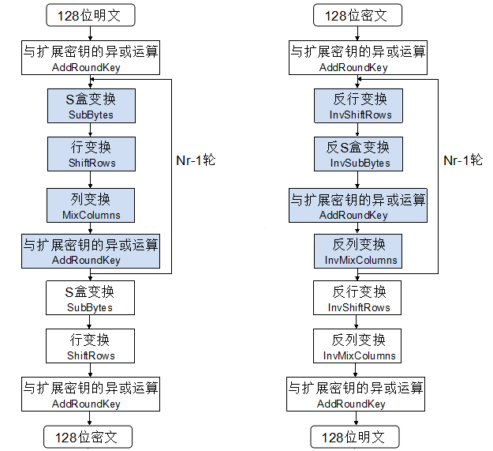
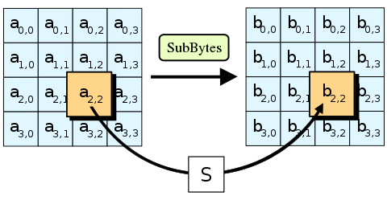
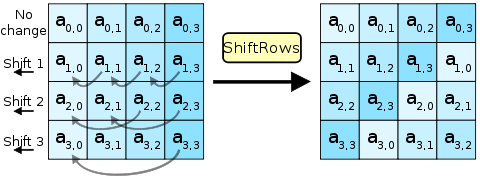
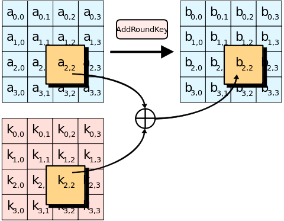

# python 实现 AES 加密

摘要：作为新一代的加密标准，AES 旨在取代 [DES](https://blog.vhcffh.com/python-implements-des-encryption/)，以适应当今分布式开放网络对数据加密安全性的要求。
本文在分析了 AES 加密原理的基础上着重说明了算法实现的具体步骤，并用 python 实现了对字符串的加密和解密。

## AES 介绍

AES（高级加密标准，Advanced Encryption Standard），在密码学中又称 Rijndael 加密法，是美国联邦政府采用的一种分组加密标准。这个标准用来替代原先的 DES，目前已经广为全世界所使用，成为对称密钥算法中最流行的算法之一。

在 AES 出现之前，最常用的对称密钥算法是 DES 加密算法，它在 1977 年被公布成为美国政府的商用加密标准。
DES 的主要问题是密钥长度较短，渐渐不适合于分布式开放网络对数据加密安全性的要求。
因此，1998 年美国政府决定不再继续延用 DES 作为联邦加密标准，并发起了征集 AES 候选算法的活动。
征集活动对 AES 的基本要求是： 比三重 DES 快、至少与三重 DES 一样安全、数据分组长度为 128 比特、密钥长度为 128/192/256 比特。

经过三年多的甄选，比利时的密码学家所设计的 Rijndael 算法最终脱颖而出，成为新一代的高级加密标准，并于 2001 年由美国国家标准与技术研究院（NIST）发布于 FIPS PUB 197。

## AES 算法原理

AES 算法（即 Rijndael 算法）是一个对称分组密码算法。
数据分组长度必须是 128 bits，使用的密钥长度为 128，192 或 256 bits。
对于三种不同密钥长度的 AES 算法，分别称为“AES-128”、“AES-192”、“AES-256”。
（Rijndael 的设计还可以处理其它的分组长度和密钥长度，但 AES 标准中没有采用）

下图是 AES 加密解密的整体流程图：



这里我们需要知道 3 个符号：

- Nb: 状态 State 包含的列（32-bit 字）的个数，也就是说 Nb=4；
- Nk: 密钥包含的 32-bit 字的个数，也就是说 Nk=4，6 或 8；
- Nr: 加密的轮数，对于不同密钥长度，轮数不一样，具体如下表所示：

|         | 密钥长度(Nk words) | 分组大小(Nb words) | 轮数(Nr) |
| :-----: | :----------------: | :----------------: | :------: |
| AES-128 |         4          |         4          |    10    |
| AES-192 |         6          |         4          |    12    |
| AES-256 |         8          |         4          |    14    |

下面分三个部分对 AES 加密解密流程进行梳理

### 密钥扩展

AES 算法通过密钥扩展程序（Key Expansion）将用户输入的密钥`K`扩展生成`Nb(Nr+1)`个字，存放在一个线性数组`w[Nb*(Nr+1)]`中。具体如下：

1. 位置变换函数`RotWord()`，接受一个字`[a0, a1, a2, a3]`作为输入，循环左移一个字节后输出`[a1, a2, a3, a0]`。
2. S 盒变换函数`SubWord()`，接受一个字`[a0, a1, a2, a3]`作为输入。S 盒是一个 16x16 的表，其中每一个元素是一个字节。对于输入的每一个字节，前四位组成十六进制数`x`作为行号，后四位组成的十六进制数`y`作为列号，查找表中对应的值。最后函数输出 4 个新字节组成的 32-bit 字。
3. 轮常数`Rcon[]`，如何计算的就不说了，直接把它当做常量数组。
   扩展密钥数组`w[]`的前`Nk`个元素就是外部密钥`K`,后的元素`w[i]`等于它前一个元素`w[i-1]`与前第`Nk`个元素`w[i-Nk]`的异或，即`w[i] = w[i-1] XOR w[i-Nk]`；但若`i`为`Nk`的倍数，则`w[i] = w[i-Nk] XOR SubWord(RotWord(w[i-1])) XOR Rcon[i/Nk-1]`。

注意，上面的第四步说明仅适合于 AES-128 和 AES-192;

### 加密

AES 加密过程涉及到 4 种变换：S 盒变换，行变换，列变换，与扩展密钥的异或

#### S 盒变换-SubBytes()

在密钥扩展部分已经讲过了，S 盒是一个 16 行 16 列的表，表中每个元素都是一个字节。S 盒变换很简单：函数`SubBytes()`接受一个 4x4 的字节矩阵作为输入，对其中的每个字节，前四位组成十六进制数 x 作为行号，后四位组成的十六进制数 y 作为列号，查找表中对应的值替换原来位置上的字节。



#### 行变换-ShiftRows()

行变换也很简单，它仅仅是将矩阵的每一行以字节为单位循环移位：第一行不变，第二行左移一位，第三行左移两位，第四行左移三位。如下图所示：



#### 与扩展密钥的异或-AddRoundKey()

扩展密钥只参与了这一步。根据当前加密的轮数，用`w[]`中的 4 个扩展密钥与矩阵的 4 个列进行按位异或。如下图：



### 解密

解密需要分别实现 S 盒变换、行变换和列变换的逆变换 InvShiftRows(),InvSubBytes(),InvMixColumns()

## python 实现

```python
S_Box = [
    [0x63, 0x7C, 0x77, 0x7B, 0xF2, 0x6B, 0x6F, 0xC5,
     0x30, 0x01, 0x67, 0x2B, 0xFE, 0xD7, 0xAB, 0x76],
    [0xCA, 0x82, 0xC9, 0x7D, 0xFA, 0x59, 0x47, 0xF0,
     0xAD, 0xD4, 0xA2, 0xAF, 0x9C, 0xA4, 0x72, 0xC0],
    [0xB7, 0xFD, 0x93, 0x26, 0x36, 0x3F, 0xF7, 0xCC,
     0x34, 0xA5, 0xE5, 0xF1, 0x71, 0xD8, 0x31, 0x15],
    [0x04, 0xC7, 0x23, 0xC3, 0x18, 0x96, 0x05, 0x9A,
     0x07, 0x12, 0x80, 0xE2, 0xEB, 0x27, 0xB2, 0x75],
    [0x09, 0x83, 0x2C, 0x1A, 0x1B, 0x6E, 0x5A, 0xA0,
     0x52, 0x3B, 0xD6, 0xB3, 0x29, 0xE3, 0x2F, 0x84],
    [0x53, 0xD1, 0x00, 0xED, 0x20, 0xFC, 0xB1, 0x5B,
     0x6A, 0xCB, 0xBE, 0x39, 0x4A, 0x4C, 0x58, 0xCF],
    [0xD0, 0xEF, 0xAA, 0xFB, 0x43, 0x4D, 0x33, 0x85,
     0x45, 0xF9, 0x02, 0x7F, 0x50, 0x3C, 0x9F, 0xA8],
    [0x51, 0xA3, 0x40, 0x8F, 0x92, 0x9D, 0x38, 0xF5,
     0xBC, 0xB6, 0xDA, 0x21, 0x10, 0xFF, 0xF3, 0xD2],
    [0xCD, 0x0C, 0x13, 0xEC, 0x5F, 0x97, 0x44, 0x17,
     0xC4, 0xA7, 0x7E, 0x3D, 0x64, 0x5D, 0x19, 0x73],
    [0x60, 0x81, 0x4F, 0xDC, 0x22, 0x2A, 0x90, 0x88,
     0x46, 0xEE, 0xB8, 0x14, 0xDE, 0x5E, 0x0B, 0xDB],
    [0xE0, 0x32, 0x3A, 0x0A, 0x49, 0x06, 0x24, 0x5C,
     0xC2, 0xD3, 0xAC, 0x62, 0x91, 0x95, 0xE4, 0x79],
    [0xE7, 0xC8, 0x37, 0x6D, 0x8D, 0xD5, 0x4E, 0xA9,
     0x6C, 0x56, 0xF4, 0xEA, 0x65, 0x7A, 0xAE, 0x08],
    [0xBA, 0x78, 0x25, 0x2E, 0x1C, 0xA6, 0xB4, 0xC6,
     0xE8, 0xDD, 0x74, 0x1F, 0x4B, 0xBD, 0x8B, 0x8A],
    [0x70, 0x3E, 0xB5, 0x66, 0x48, 0x03, 0xF6, 0x0E,
     0x61, 0x35, 0x57, 0xB9, 0x86, 0xC1, 0x1D, 0x9E],
    [0xE1, 0xF8, 0x98, 0x11, 0x69, 0xD9, 0x8E, 0x94,
     0x9B, 0x1E, 0x87, 0xE9, 0xCE, 0x55, 0x28, 0xDF],
    [0x8C, 0xA1, 0x89, 0x0D, 0xBF, 0xE6, 0x42, 0x68,
     0x41, 0x99, 0x2D, 0x0F, 0xB0, 0x54, 0xBB, 0x16]]

Inv_S_Box = [
    [0x52, 0x09, 0x6A, 0xD5, 0x30, 0x36, 0xA5, 0x38,
     0xBF, 0x40, 0xA3, 0x9E, 0x81, 0xF3, 0xD7, 0xFB],
    [0x7C, 0xE3, 0x39, 0x82, 0x9B, 0x2F, 0xFF, 0x87,
     0x34, 0x8E, 0x43, 0x44, 0xC4, 0xDE, 0xE9, 0xCB],
    [0x54, 0x7B, 0x94, 0x32, 0xA6, 0xC2, 0x23, 0x3D,
     0xEE, 0x4C, 0x95, 0x0B, 0x42, 0xFA, 0xC3, 0x4E],
    [0x08, 0x2E, 0xA1, 0x66, 0x28, 0xD9, 0x24, 0xB2,
     0x76, 0x5B, 0xA2, 0x49, 0x6D, 0x8B, 0xD1, 0x25],
    [0x72, 0xF8, 0xF6, 0x64, 0x86, 0x68, 0x98, 0x16,
     0xD4, 0xA4, 0x5C, 0xCC, 0x5D, 0x65, 0xB6, 0x92],
    [0x6C, 0x70, 0x48, 0x50, 0xFD, 0xED, 0xB9, 0xDA,
     0x5E, 0x15, 0x46, 0x57, 0xA7, 0x8D, 0x9D, 0x84],
    [0x90, 0xD8, 0xAB, 0x00, 0x8C, 0xBC, 0xD3, 0x0A,
     0xF7, 0xE4, 0x58, 0x05, 0xB8, 0xB3, 0x45, 0x06],
    [0xD0, 0x2C, 0x1E, 0x8F, 0xCA, 0x3F, 0x0F, 0x02,
     0xC1, 0xAF, 0xBD, 0x03, 0x01, 0x13, 0x8A, 0x6B],
    [0x3A, 0x91, 0x11, 0x41, 0x4F, 0x67, 0xDC, 0xEA,
     0x97, 0xF2, 0xCF, 0xCE, 0xF0, 0xB4, 0xE6, 0x73],
    [0x96, 0xAC, 0x74, 0x22, 0xE7, 0xAD, 0x35, 0x85,
     0xE2, 0xF9, 0x37, 0xE8, 0x1C, 0x75, 0xDF, 0x6E],
    [0x47, 0xF1, 0x1A, 0x71, 0x1D, 0x29, 0xC5, 0x89,
     0x6F, 0xB7, 0x62, 0x0E, 0xAA, 0x18, 0xBE, 0x1B],
    [0xFC, 0x56, 0x3E, 0x4B, 0xC6, 0xD2, 0x79, 0x20,
     0x9A, 0xDB, 0xC0, 0xFE, 0x78, 0xCD, 0x5A, 0xF4],
    [0x1F, 0xDD, 0xA8, 0x33, 0x88, 0x07, 0xC7, 0x31,
     0xB1, 0x12, 0x10, 0x59, 0x27, 0x80, 0xEC, 0x5F],
    [0x60, 0x51, 0x7F, 0xA9, 0x19, 0xB5, 0x4A, 0x0D,
     0x2D, 0xE5, 0x7A, 0x9F, 0x93, 0xC9, 0x9C, 0xEF],
    [0xA0, 0xE0, 0x3B, 0x4D, 0xAE, 0x2A, 0xF5, 0xB0,
     0xC8, 0xEB, 0xBB, 0x3C, 0x83, 0x53, 0x99, 0x61],
    [0x17, 0x2B, 0x04, 0x7E, 0xBA, 0x77, 0xD6, 0x26,
     0xE1, 0x69, 0x14, 0x63, 0x55, 0x21, 0x0C, 0x7D]]

# 轮常数，密钥扩展中用到。（AES-128只需要10轮）
Rcon = [0x01000000, 0x02000000, 0x04000000, 0x08000000, 0x10000000,
        0x20000000, 0x40000000, 0x80000000, 0x1b000000, 0x36000000]


# 密钥扩展
# 字循环左移一个字节
def RotWord(x):
    return ((x << 8) | (x >> 24)) & 0xffffffff


# S盒变换
def SubWord(x):
    temp = 0
    temp = (temp << 8) | S_Box[(x >> 28) & 0x0f][(x >> 24) & 0x0f]
    temp = (temp << 8) | S_Box[(x >> 20) & 0x0f][(x >> 16) & 0x0f]
    temp = (temp << 8) | S_Box[(x >> 12) & 0x0f][(x >> 8) & 0x0f]
    temp = (temp << 8) | S_Box[(x >> 4) & 0x0f][(x >> 0) & 0x0f]
    return temp


# 加密过程
# 轮密钥加变换 - 将每一列与扩展密钥进行异或
def AddRoundKey(mtx, ikey):
    rmtx = []
    for i in range(4):
        for j in range(4):
            rmtx.append((mtx[4 * i + j] ^ ((ikey[j] << 8 * i) >> 24)) & 0xff)
    return bytes(rmtx)


# S盒变换 - 前4位为行号，后4位为列号
def Subbytes(mtx):
    rmtx = []
    for i in mtx:
        rmtx.append(S_Box[i >> 4][i & 0x0f])
    return bytes(rmtx)


# 行变换 - 按字节循环移位
def ShiftRows(mtx):
    rmtx = b''
    rmtx += mtx[0:4] + \
            mtx[5:8] + mtx[4:5] + \
            mtx[10:12] + mtx[8:10] + \
            mtx[15:16] + mtx[12:15]
    return rmtx


# 有限域上的乘法 GF(2^8)
def GFMul(a, b):
    p, hi_bit_set = 0, 0
    for counter in range(8):
        if b & 1 != 0:
            p ^= a
        hi_bit_set = a & 0x80
        a = (a << 1) & 0xff
        if hi_bit_set != 0:
            a ^= 0x1b  # x^8 + x^4 + x^3 + x + 1
        b >>= 1
    return p & 0xff


# 列变换
def MixColumns(mtx):
    rmtx = [0] * 16
    for i in range(4):
        arr = []
        for j in range(4):
            arr.append(mtx[i + j * 4])
        rmtx[i] = GFMul(0x02, arr[0]) ^ GFMul(0x03, arr[1]) ^ arr[2] ^ arr[3]
        rmtx[i + 4] = arr[0] ^ GFMul(0x02, arr[1]) ^ GFMul(0x03, arr[2]) ^ arr[3]
        rmtx[i + 8] = arr[0] ^ arr[1] ^ GFMul(0x02, arr[2]) ^ GFMul(0x03, arr[3])
        rmtx[i + 12] = GFMul(0x03, arr[0]) ^ arr[1] ^ arr[2] ^ GFMul(0x02, arr[3])
    return bytes(rmtx)


# 解密过程
# 逆行变换 - 按字节循环移位
def InvShiftRows(mtx):
    rmtx = b''
    rmtx += mtx[0:4] + \
            mtx[7:8] + mtx[4:7] + \
            mtx[10:12] + mtx[8:10] + \
            mtx[13:16] + mtx[12:13]
    return rmtx


# 逆S盒变换 - 前4位为行号，后4位为列号
def InvSubbytes(mtx):
    rmtx = []
    for i in mtx:
        rmtx.append(Inv_S_Box[i >> 4][i & 0x0f])
    return bytes(rmtx)


# 逆列变换
def InvMixColumns(mtx):
    rmtx = [0] * 16
    for i in range(4):
        arr = []
        for j in range(4):
            arr.append(mtx[i + j * 4])
        rmtx[i] = GFMul(0x0e, arr[0]) ^ GFMul(0x0b, arr[1]) ^ GFMul(0x0d, arr[2]) ^ GFMul(0x09, arr[3])
        rmtx[i + 4] = GFMul(0x09, arr[0]) ^ GFMul(0x0e, arr[1]) ^ GFMul(0x0b, arr[2]) ^ GFMul(0x0d, arr[3])
        rmtx[i + 8] = GFMul(0x0d, arr[0]) ^ GFMul(0x09, arr[1]) ^ GFMul(0x0e, arr[2]) ^ GFMul(0x0b, arr[3])
        rmtx[i + 12] = GFMul(0x0b, arr[0]) ^ GFMul(0x0d, arr[1]) ^ GFMul(0x09, arr[2]) ^ GFMul(0x0e, arr[3])
    return bytes(rmtx)


class AES(object):
    # AES-128
    #    Nk密钥长度(双字)，Nb分组大小(双字)，Nr轮数
    # 128   4               4               10
    # 192   6               4               12
    # 256   8               4               14
    # 128 4*4*8=128bits   4*4*8=128bits     10轮
    def __init__(self, K: bytes):
        self.Nk, self.Nb, self.Nr = 4, 4, 10
        # 通过密钥K生成实例，密钥K位数不足补零
        self.K = K[:self.Nk * 4]
        while len(self.K) < self.Nk * 4:
            self.K += b'\x00'
        self.W = self.KeyExpansion()

    def Encrypt(self, m: bytes) -> bytes:
        # 加密
        # 明文不足16*8bits补零
        while len(m) % 16 != 0:
            m += b'\x00'
        c = b''
        for i in range(len(m) // 16):
            # 对每一个16*8bits的块进行循环
            mtx = m[i * 16:i * 16 + 16]
            ikey = self.W[:4]
            mtx = AddRoundKey(mtx, ikey)
            for round in range(1, self.Nr):
                mtx = Subbytes(mtx)
                mtx = ShiftRows(mtx)
                mtx = MixColumns(mtx)
                ikey = self.W[4*round:4*round+4]
                mtx = AddRoundKey(mtx, ikey)
            mtx = Subbytes(mtx)
            mtx = ShiftRows(mtx)
            ikey = self.W[4 * self.Nr:]
            mtx = AddRoundKey(mtx, ikey)
            c += mtx
        return c

    def Decrypt(self, m: bytes) -> bytes:
        # 解密
        c = b''
        for i in range(len(m) // 16):
            mtx = m[i * 16:i * 16 + 16]
            ikey = self.W[self.Nr * 4:]
            mtx = AddRoundKey(mtx, ikey)
            for round in range(self.Nr-1, 0, -1):
                mtx = InvShiftRows(mtx)
                mtx = InvSubbytes(mtx)
                ikey = self.W[4 * round:4 * round + 4]
                mtx = AddRoundKey(mtx, ikey)
                mtx = InvMixColumns(mtx)
            mtx = InvShiftRows(mtx)
            mtx = InvSubbytes(mtx)
            ikey = self.W[:4]
            mtx = AddRoundKey(mtx, ikey)
            c += mtx
        return c

    def KeyExpansion(self):
        # 密钥扩展函数，密钥 K 扩展生成 Nb(Nr+1)个字  4*4*8bits=128bits -> 4*(10+1)*32bits=1408bits
        w = []
        for i in range(self.Nk):
            temp = 0
            for j in range(4):
                temp = (temp << 8) | self.K[4 * i + j]
            w.append(temp)
        for i in range(self.Nk, self.Nb * (self.Nr + 1)):
            temp = w[i - 1]
            if i % self.Nk == 0:
                temp = SubWord(RotWord(temp)) ^ Rcon[i // self.Nk - 1]
            elif self.Nk > 6 and i % self.Nk == 4:
                temp = SubWord(temp)
            w.append(w[i - self.Nk] ^ temp)
        return w

    def getK(self) -> bytes:
        # 返回密钥K
        return self.K

    def generateK(self) -> bytes:
        # 随机产生密钥K
        pass


def print_bytes_hex(m):
    for i in m:
        print(hex(i)[2:].rjust(2, '0'), end='')
    print()


if __name__ == '__main__':
    # AES-128
    # 密钥不足128bits 添零，多余128bits 截取前128bits
    # messages 不足128bits的倍数 补零
    m = b'https://blog.vhcffh.com'
    key = b'123456'
    a = AES(key)
    cc = a.Encrypt(m)
    mm = a.Decrypt(cc)
    print("明文:", end='')
    print(m)
    print("密钥:", end='')
    print(a.K)
    print("密文:", end='')
    print_bytes_hex(cc)  # 以bytes输出
    print("解密:", end='')
    print(mm)

```

## 参考

1. [aes 加密 python 源码](https://github.com/FreyZhang007/python-encrypt/blob/93090b37a92005781c01bf21921c632e35f50254/aes.py)
2. [Advanced Encryption Standard](https://en.wikipedia.org/wiki/Advanced_Encryption_Standard)
3. [DES 加密算法的 C++实现](https://songlee24.github.io/2014/12/06/des-encrypt/)
