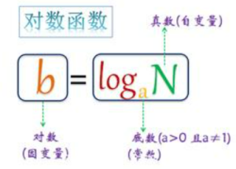
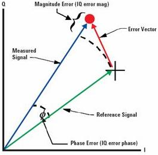

# SNR 与 EVM 的关系

## 关系

当 SNR 较大（大于 10dB）时，**SNR=-20lg(EVM)**，其中 SNR 的单位为 dB，EVM 为正实数。

如果 EVM 用 dB 表示，可以简化为**SNR = -2\*EVM_dB**。(此式在 SNR 大于 4dB 时，误差较小，不超过 1dB)

下面依次介绍 log、dB、dBm、evm、snr 的概念，再说明此结论的推导过程。

## 对数公式

如果 a^b=N(a>0,且 a≠1，则 b 叫做以 a 为底 N 的对数，公式如下，其中 a 叫做底数，N 叫做真数， b 叫对数。



通常我们将以 10 为底的对数叫常用对数，以 e 为底的对数叫自然对数。

常用对数：$ lg(b) = log\_{10}(b) $ (10 为底数)。

自然对数：$ ln(b) = log\_{e}(b) $ (e 为对数)。

对数的基本性质中，下面的结论经常用到：

```math
\begin{array}{l}
log_{a}M^n = nlog_{a}M \cr
lg10 = 1 \cr
lg2 \approx 0.3 \cr
lg1 = 0
\end{array}
```

## 信号强度

日常中通常使用功率来衡量一个电器做功的快慢，如一个 10W 的电灯泡，10W 功率就是电灯泡消耗能量做功的快慢。

在天线收发系统里，同样也需要消耗电能来转换为电磁波的能量进行传输。

但是电磁波的能量衰减非常快，例如一个 100mW 的能量源，传输一段距离后很快就能衰减成 1mW、0.1mW、0.01mW 甚至更小。

对于这种呈几何数量级的衰减，使用功率来衡量会给计数带来不便，因此引用新的概念：dB 和 dBm。

### dB 介绍

dB 是一个表征相对值的值，纯粹的比值，只表示**两个量的相对大小关系，没有单位**。公式为 dB=10lg(A/B)，**一般作为（SNR）信噪比、损耗的单位**。

当考虑甲的功率相比于乙功率大或小多少个 dB 时，按下面的计算公式：10log（甲功率/乙功率）。

例如 A 的功率为 100mW，B 的功率为 10mW，则 10lg（100 / 10） = 10dB，说明 A 比 B 大 10dB。

> 例：如何理解：+3 dB 表示增大为两倍，-3 dB 表示下降为 1/2。
> 如果 A 的功率开始为 100mW，经过衰减变成了 50mw，则 10lg（50 / 100） = 10lg（1/ 2） = -10lg（2）= -3dB。
> 如果 A 的功率开始为 100mW，经过放大变成了 200mw，则 10lg（200 / 100） = 10lg（2） = 3dB。

### dBm 介绍

dBm 是一个表示功率绝对值（可以认为是以 1mW 功率为基准的一个比值），计算公式为：10log（功率值/1mw）。

记住一个口诀： 加 3 乘 2， 加 10 乘 10； 减 3 除 2，减 10 除 10 （+3 dB，表示功率增加为 2 倍；+10 dB，表示功率增加为 10 倍。-3 dB，表示功率减小为 1/2；-10 dB，表示功率减小为 1/10）。

> 例：功率 P 为 1mw，折算为 dBm 后为 0dBm。
> 40W 的功率，按 dBm 单位进行折算后的值应为：
> 10log（40W/1mw)=10log（40000）= 46dBm。 按口决： 40W = 1w _ (( 10 _ 10 _ 10)W _ 10 _ 2 _ 2) => 10 + 10 + 10 + 10 + 3 + 3 = 46dBm
> 那么 44dBm 是多少 W？ (25W)

需要注意的是，对于功率的增益，我们用 10lg（Po/Pi），而对于电压和电流的增益，要用 20lg（Vo/Vi）、20lg（Io/Ii）。

原因是 这个 2 来源于电功率转换公式的平方上：

```math
P = UI = I^2R = \frac {U^2} {R}
```

## SNR 和 EVM

### SNR 介绍

信噪比 SNR（Signal-to-noise Ratio），指的是系统中信号与噪声的比。公式为 SNR = 10lg（Ps / Pn），其中：

- SNR：信噪比，单位是 dB。
- Ps：信号的有效功率。
- Pn：噪声的有效功率。

```math
SNR(dB) = 10 *lg \frac {\int s(t)^2 \mathrm{d}t} {\int n(t)^2 \mathrm{d}t} =
10 * lg \frac {\int s(t)^2 \mathrm{d}t} {\int (x(t)-s(t))^2 \mathrm{d}t}\tag{1}
```

式中$ x(t) $ 为矢量 reference signal，$ s(t) $ 为矢量输入信号。

### EVM 介绍



QAM 调制信号通常用其 EVM 来衡量信号质量，EVM 是英文 Error Vector Magnitude 缩写，意为误差向量幅度。

误差矢量 Error Vector 的幅度与参考信号 Reference Signal 幅度的比值。通常测量的 EVM 为其 RMS 值（Root Mean Square 均方根），计算公式如：

```math
EVM=\sqrt {\frac {\int (x(t)-s(t))^2 \mathrm{d}t} {\int x(t)^2 \mathrm{d}t}}\tag{2}
```

式中$ x(t) $ 为矢量 reference signal，$ s(t) $ 为矢量输入信号。

大多时候，EVM 用 dB 表示:

```math
EVM_{dB} = 10*lg{EVM}
```

### SNR 与 EVM 关系

从（1）式 和（2）式可以看出：当矢量输入信号$ s(t) $越接近于矢量reference signal $ x(t) $，即$ s(t) $可以用$ x(t) $代替，推导如下：

```math
\begin{array}{l}
SNR(dB) = 10 * lg \frac {\int s(t)^2 \mathrm{d}t} {\int (x(t)-s(t))^2 \mathrm{d}t} \cr
\approx 10 * lg \frac {\int x(t)^2 \mathrm{d}t} {\int (x(t)-s(t))^2 \mathrm{d}t} \cr
= -1 * 10 * lg \frac {\int (x(t)-s(t))^2 \mathrm{d}t} {\int x(t)^2 \mathrm{d}t} \cr
= -10 * lg({EVM}^2) \cr
=-2 * 10 * lg(EVM)
=-2EVM_{dB}
\end{array}
```
