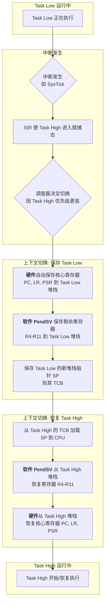
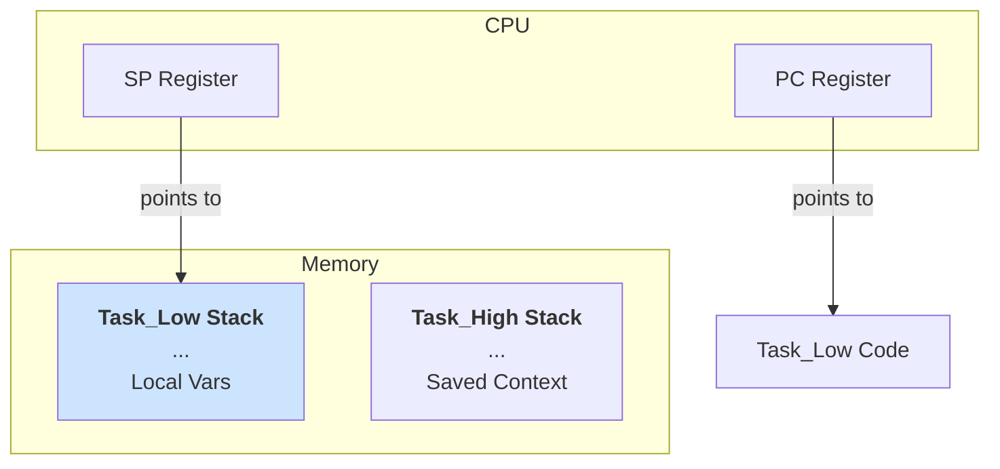
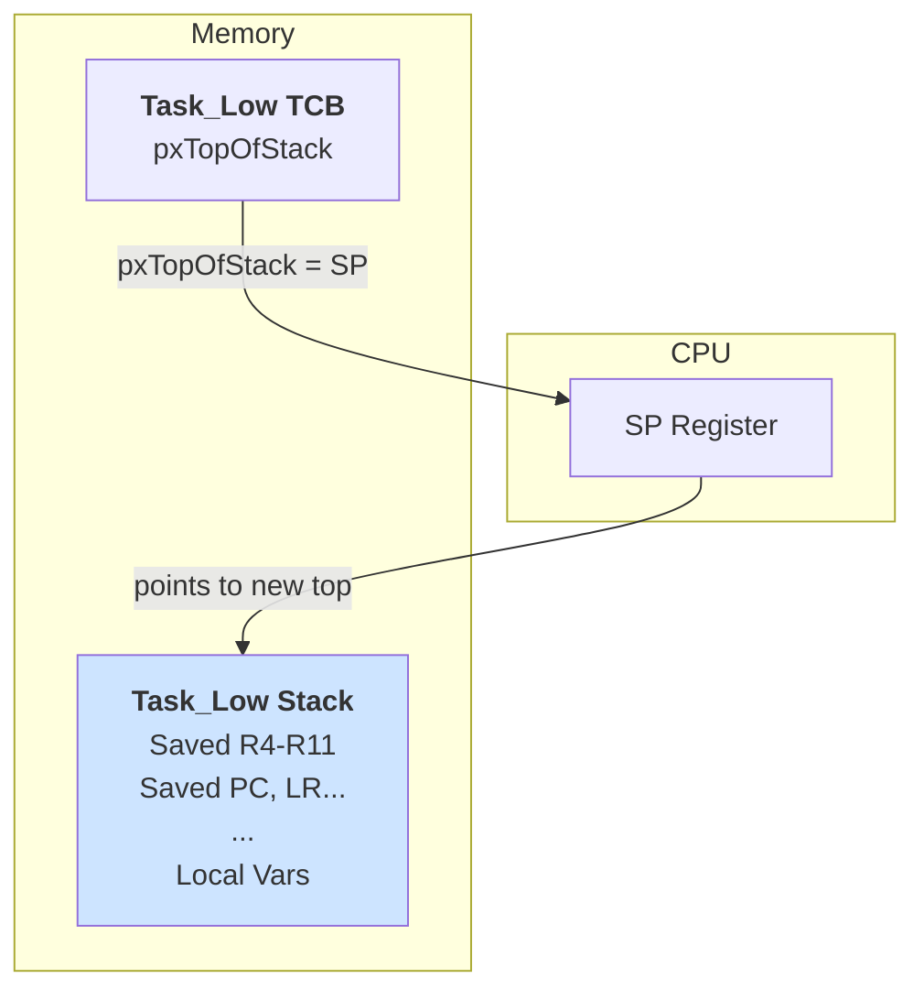
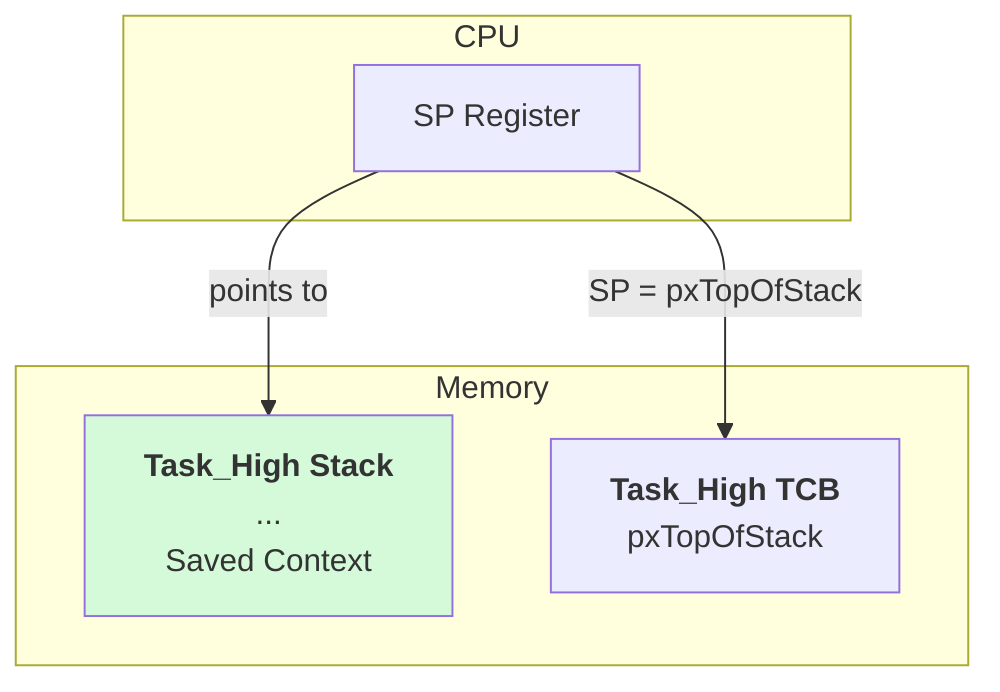

FreeRTOS 作为一个轻量级的实时操作系统（RTOS），其核心功能之一就是任务调度。它允许多个任务“同时”运行，为嵌入式系统提供了并发处理能力。要真正理解 FreeRTOS 是如何工作的，就必须深入其任务调度和上下文切换的底层细节。

本文将详细解析 FreeRTOS 的任务调度过程，特别是任务切换时堆栈（Stack）和关键寄存器（SP, PC 等）的变化情况。

## 任务状态

在任何时刻，一个任务都必然处于以下几种状态之一：

- **运行态 (Running)**: 任务当前正在 CPU 上执行。在单核处理器上，永远只有一个任务处于运行态。
- **就绪态 (Ready)**: 任务已经准备好，可以运行，但因为有更高优先级的任务正在运行，所以它在等待 CPU。
- **阻塞态 (Blocked)**: 任务正在等待某个外部事件（例如 `vTaskDelay` 延时、等待信号量、队列数据等），在此期间它不会被调度。
- **挂起态 (Suspended)**: 任务被显式地“暂停”，除非被显式地恢复，否则调度器会完全忽略它。

调度器的核心职责，就是在所有处于“就绪态”的任务中，选择优先级最高的那个，让它进入“运行态”。

## FreeRTOS 调度器原理

FreeRTOS 采用的是**基于优先级**的**抢占式调度**算法。

- **基于优先级**: 每个任务都被赋予一个优先级。调度器总是确保当前运行的是所有就绪态任务中优先级最高的那个。
- **抢占式**: 如果一个高优先级的任务变为就绪态（例如，一个中断服务程序唤醒了它），而当前正在运行的是一个低优先级的任务，调度器会立即暂停（抢占）低优先级任务，让高优先级任务运行。

这种机制的切换点被称为**上下文切换 (Context Switch)**。

## 上下文切换 (Context Switch) 详解

上下文切换是 FreeRTOS 实现多任务并发的魔法核心。它指的是保存当前运行任务的 CPU 状态（上下文），然后加载即将运行任务的 CPU 状态的过程。

**任务的上下文主要包括：**

1.  **CPU 寄存器**: 通用寄存器（在 ARM Cortex-M 中如 R0-R12）、程序计数器 (PC)、链接寄存器 (LR)、程序状态寄存器 (PSR) 等。
2.  **任务堆栈指针 (SP)**: 指向该任务私有堆栈的栈顶。

每个任务都有一个独立的**任务控制块 (Task Control Block, TCB)**，它是一个数据结构，用于存储任务的所有信息，其中最重要的就是任务的堆栈指针 `pxTopOfStack`。

### 切换过程拆解

假设当前正在运行 `Task_Low` (低优先级)，此时一个中断发生，使得 `Task_High` (高优先级) 从阻塞态变为了就绪态。当中断服务程序（ISR）完成时，调度器将被触发，执行一次上下文切换。

_上下文切换流程图_

#### 第 1 步：保存 `Task_Low` 的上下文

当中断发生时，CPU 硬件会自动将一部分核心寄存器（如 PC, PSR, LR 等）压入 `Task_Low` 的堆栈。在 FreeRTOS 的切换机制（通常在 `PendSV_Handler` 中实现）里，会继续执行以下操作：

1.  **软件压栈**: 将 CPU 中剩余的通用寄存器（R4-R11 等，具体取决于架构）也压入 `Task_Low` 的堆栈。
2.  **保存 SP**: 将当前堆栈指针 SP 的值，保存到 `Task_Low` 的 TCB 中的 `pxTopOfStack` 成员里。

至此，`Task_Low` 的所有“记忆”（即它运行到哪里，各个寄存器的值是什么）都被完整地保存在了它自己的堆栈中。

#### 第 2 步：选择下一个要运行的任务

调度器会查看就绪任务列表，发现 `Task_High` 是当前优先级最高的就绪任务，因此决定下一个运行它。

#### 第 3 步：恢复 `Task_High` 的上下文

1.  **加载 SP**: 从 `Task_High` 的 TCB 中，读取 `pxTopOfStack` 的值，并将其加载到 CPU 的 SP 寄存器中。现在，SP 指向了 `Task_High` 的堆栈顶。
2.  **软件弹栈**: 从 `Task_High` 的堆栈中，将之前保存的 R4-R11 等通用寄存器依次弹出，恢复到 CPU 的相应寄存器中。
3.  **硬件弹栈与返回**: 当 `PendSV_Handler` 退出时，CPU 硬件会自动从 `Task_High` 的堆栈中弹出之前保存的 PC, PSR, LR 等寄存器。

当 PC 寄存器被恢复后，CPU 的下一条指令就会从 `Task_High` 上次被中断的地方继续执行。至此，一次完整的上下文切换完成。

### 堆栈与寄存器变化图解

让我们更直观地看看这个过程。

**1. 切换前:**

- CPU 的 SP 寄存器指向 `Task_Low` 的堆栈。
- CPU 的 PC 寄存器指向 `Task_Low` 正在执行的代码。

**2. 切换中 (保存 `Task_Low`):**

- `Task_Low` 的所有寄存器被压入其堆栈。
- `Task_Low` 的 TCB 更新：`tcb_low.pxTopOfStack = SP`。

**3. 切换中 (恢复 `Task_High`):**

- SP 更新：`SP = tcb_high.pxTopOfStack`。
- `Task_High` 的寄存器从其堆栈中弹出到 CPU。

**4. 切换后:**

- CPU 的 SP 寄存器指向 `Task_High` 的堆栈。
- CPU 的 PC 寄存器指向 `Task_High` 的代码。`Task_High` 开始运行。

## 关键寄存器的作用

- **SP (Stack Pointer)**: 任务切换的“定位器”。它的值在 TCB 和 CPU 之间来回传递，确保了每个任务都能找到自己独立的堆栈空间。
- **PC (Program Counter)**: 任务执行的“指令指针”。保存和恢复 PC 是实现任务断点续传的关键，使得任务看起来像是连续执行的。
- **LR (Link Register)**: 函数调用的“返回地址”。每个任务都有自己的调用栈，LR 必须作为上下文的一部分被保存，否则函数调用关系会错乱。
- **PSR (Program Status Register)**: 任务的“状态标志”。包含了条件码（零、负、进位等），控制着条件分支的执行，必须被精确恢复。

## 总结

FreeRTOS 的任务调度是一个高效且精巧的机制。它通过为每个任务维护一个独立的堆栈和 TCB，在上下文切换时，利用 `PendSV` 这个特殊设计的低优先级中断，快速地保存和恢复 CPU 寄存器，从而实现了任务之间的无缝切换。

理解这一底层过程，不仅能帮助我们更好地使用 FreeRTOS，还能在遇到多任务相关的疑难- 杂症时，提供更深入的调试思路。
