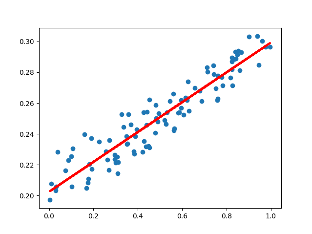
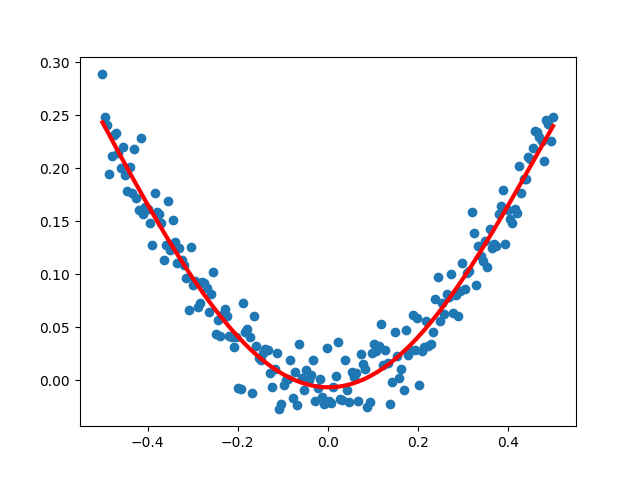

# Keras 基础

::: tip 参考文档
[Keras 官网文档](https://keras.io)
:::

## 安装

```bash
# 安装 Tensorflow
pip install tensorflow --user -i https://pypi.tuna.tsinghua.edu.cn/simple
# 安装 Keras
pip install keras --user -i https://pypi.tuna.tsinghua.edu.cn/simple
```

## 线性回归

### 示例程序

```python
import numpy as np
import matplotlib.pyplot as plt
from keras.src.models import Sequential  # Keras 中的顺序模型
from keras.src.layers import Dense  # Keras 中的全连接层
from keras.src.layers import Input

# 构造训练样本
x_train = np.random.rand(100)  # 一维数据，样本量 100，服从均一分布
noise = np.random.normal(0, 0.01, x_train.shape)  # 噪声数据，服从高斯分布（正态分布）
y_train = x_train * 0.1 + 0.2 + noise

# 编译模型
model = Sequential()  # 顺序模型
model.add(Input(shape=(1,)))  # 输入数据 1 维
model.add(Dense(units=1))  # 全连接层，输出数据 1 维，
model.compile(optimizer="sgd", loss="mse")  # 优化算法：随机梯度下降，损失函数：均方差

# 训练样本
for step in range(5000):
    cost = model.train_on_batch(x_train, y_train)
    if step % 500 == 0:
        print("cost: ", cost)

# 查看训练得到的权重和偏置
w, b = model.layers[0].get_weights()
print("W= ", w, "b= ", b)

# 展示拟合结果
y_pred = model.predict(x_train)
plt.scatter(x_train, y_train)
plt.plot(x_train, y_pred, "r-", lw=3)
plt.show()
```

### 结果展示



## 非线性回归

### 示例程序

```python
import numpy as np
import matplotlib.pyplot as plt
from keras.src.models import Sequential  # Keras 中的顺序模型
from keras.src.layers import Input, Dense, Activation  # Keras 中的全连接层和激活函数
from keras.src.optimizers import SGD  # Keras 中的 SGD 优化器

# 构造训练样本
x_train = np.linspace(-0.5, 0.5, 200)  # 一维数据，样本量 200，等差线性分布
noise = np.random.normal(0, 0.02, x_train.shape)  # 噪声数据，服从高斯分布（正态分布）
y_train = np.square(x_train) + noise

# 编译模型
model = Sequential()  # 顺序模型
model.add(Input(shape=(1,)))
model.add(Dense(units=5))  # 全连接层，输出数据 10 维， 输入数据 1 维
model.add(Activation("tanh"))  # tanh 激活函数
model.add(Dense(units=1))  # 全连接层，输出数据 1 维， 输入数据 10 维
model.add(Activation("tanh"))  # tanh 激活函数
sgd = SGD(learning_rate=0.2)  # 设置随机梯度下降算法的学习率
model.compile(optimizer=sgd, loss="mse")  # 优化算法：随机梯度下降，损失函数：均方差

# 训练样本
for step in range(5000):
    cost = model.train_on_batch(x_train, y_train)
    if step % 500 == 0:
        print("cost: ", cost)

# 展示拟合结果
y_pred = model.predict(x_train)
plt.scatter(x_train, y_train)
plt.plot(x_train, y_pred, "r-", lw=3)
plt.show()
```

### 结果展示



## MNIST 数据分类

### 示例程序

```python
from keras.src.datasets import mnist
from tensorflow.python.keras.utils import np_utils
from keras.src.models import Sequential
from keras.src.layers import Input, Dense, Dropout
from keras.src.optimizers import SGD

# 载入数据集（第一次运行会联网下载）
(x_train, y_train), (x_test, y_test) = mnist.load_data()
print("x_train: ", x_train.shape, "y_train: ", y_train.shape)
print("x_test:  ", x_test.shape, "y_test:  ", y_test.shape)
x_train = x_train.reshape(x_train.shape[0], -1) / 255.0  # 归一化
x_test = x_test.reshape(x_test.shape[0], -1) / 255.0 # 标签值转为 one-hot 码
y_train = np_utils.to_categorical(y_train, num_classes=10)
y_test = np_utils.to_categorical(y_test, num_classes=10)

# 编译模型
model = Sequential()  # 顺序模型
model.add(Input(shape=(x_train.shape[1],)))
# 全连接层(隐藏层），输出数据 200 维，输入数据维度由训练数据本身决定, 使用 tanh 激活函数
model.add(Dense(units=196, input_dim=x_train.shape[1], activation="relu"))
# 全连接层（隐藏层），输出数据 100 维，输入数据由前一层决定, 使用 tanh 激活函数
model.add(Dense(units=98, activation="relu"))
model.add(Dropout(0.4))  # 让 20% 的神经元不工作（防止过拟合的一种手段）
# 全连接层（输出层），输出数据 10 维（共 10 种手写数字），输入数据由前一层决定, 使用 softmax 激活函数
model.add(Dense(units=10, activation="softmax"))
sgd = SGD(learning_rate=0.1)  # 设置随机梯度下降算法的学习率
model.compile(
    optimizer=sgd,
    loss="categorical_crossentropy",
    metrics=["accuracy"])  # 优化算法：随机梯度下降，损失函数：交叉熵

# 训练样本
model.fit(x_train, y_train, batch_size=32, epochs=10)

# 评估模型
loss, accuracy = model.evaluate(x_test, y_test)
print("loss= ", loss, "accuracy= ", accuracy)
```
